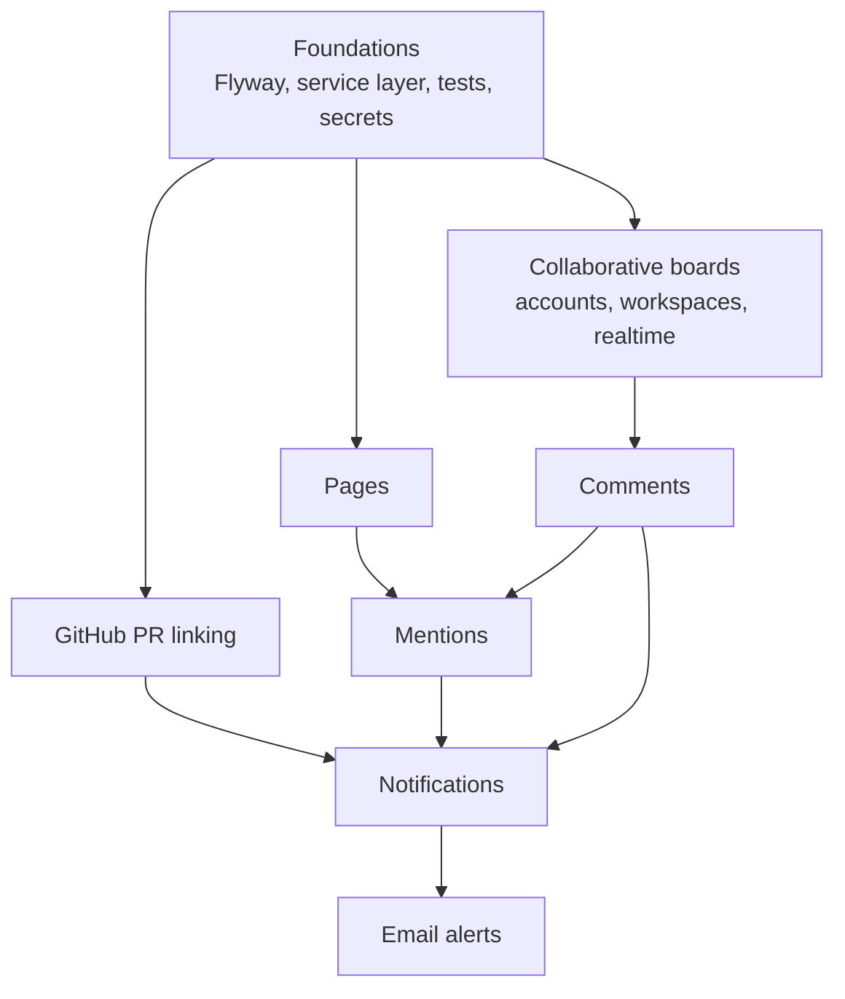

# Future features

Design docs for where Content Calendar can go next. Nothing here is built yet.
Each feature has its own folder with a full design: goals, user flows, database
schema, API, backend and frontend changes, security, testing, and a phased rollout.

| Feature | Folder | Needs real user accounts? | Rough effort (part-time) |
|---|---|---|---|
| GitHub PR linking | [github-pr-linking](github-pr-linking/README.md) | No: phase 1 works with access keys | 1–3 weeks |
| Pages (Notion-like docs) | [pages](pages/README.md) | No: v1 works with access keys | 3–6 weeks |
| Collaborative boards | [collaborative-boards](collaborative-boards/README.md) | **It introduces them** | 3–5 weeks |
| Comments | [comments](comments/README.md) | Works single-user as "notes"; real value needs accounts | 1–2 weeks |
| Mentions | [mentions](mentions/README.md) | Yes | 1 week |
| Notifications (in-app queue) | [notifications](notifications/README.md) | Mostly (due-date reminders don't) | 2–3 weeks |
| Email alerts | [email-alerts](email-alerts/README.md) | Needs a verified email address | 1–2 weeks |

## How the features depend on each other

Read it as "build the arrow's source first". Comments can technically ship before
collaboration (as private notes), but mentions and notifications only make sense
once there is more than one person on a board.

## Recommended order

1. **Foundations** (below). Every feature gets harder without them.
2. **GitHub PR linking, phase 1.** Works today with access keys, is very visible,
   and is a strong portfolio piece ("my board talks to GitHub").
3. **Pages v1.** Single-user drafts attached to cards. This is where the app stops
   being "a Trello clone" and becomes its own thing.
4. **Collaborative boards.** Accounts, workspaces, members, live updates.
5. **Comments → Mentions → Notifications → Email alerts**, in that order. Each one
   is a thin layer on the one before.

## Foundations to do before any feature

These are not features, but skipping them makes every feature below slower and riskier.

| Item | Why it matters for the features here |
|---|---|
| **Flyway for migrations** | There are already four hand-run SQL files (`src/main/resources/db/migration-00N-*.sql`). Every feature below adds tables. Flyway runs them automatically, in order, exactly once. Baseline the current database as version 4, then name new files `V5__...sql`, `V6__...sql`. The docs below say `V{n}__name.sql` for "the next number". |
| **Service layer** | Controllers call repositories directly today. Features like "post a comment, detect mentions, write a notification, all in one transaction" need a `service` package that owns the transaction. Switch from opening `Session`s by hand to Spring's `HibernateTransactionManager` + `@Transactional` at the same time. |
| **Tests** | Integration tests with Testcontainers (a real Postgres in Docker) for every repository. Collaboration bugs (wrong user sees wrong data) are the kind you only catch with tests. |
| **Secrets out of `application.properties`** | The Neon password is a fallback literal in a tracked file. GitHub App keys, email API keys and webhook secrets will join it. Use environment variables only, with no fallback. |
| **Optimistic locking** | Add `version INT NOT NULL DEFAULT 0` to `content` with Hibernate's `@Version`. Two people (or two tabs) saving the same card will otherwise silently overwrite each other. |
| **Card ordering** | Cards are ordered by `id`. Collaborative boards need drag-to-reorder within a lane: add a `position` column (fractional ranking, e.g. `NUMERIC` or LexoRank strings). |
| **Per-board card numbers** | `CC-12` is the global `SERIAL` id today, so two boards share one counter. PR linking (matching "CC-12" in a PR title) and collaboration both want numbers that belong to one board. See [collaborative-boards](collaborative-boards/README.md#card-numbers-per-workspace). |

## Conventions used in these docs

- **Package layout** follows what exists: `me.harshal.content_calendar.{controller, hibernate, model, auth, config}`, plus the new `service` package from Foundations.
- **Repositories** follow the existing raw-Hibernate style (`*HibernateRepository` with an injected `SessionFactory`) unless a doc says otherwise.
- **Frontend** follows what exists: React + Vite, plain CSS with the tokens in `frontend/src/styles.css`, inline SVG icons in `icons.jsx`, API calls through `frontend/src/api.js`. No UI library.
- **Design** extends the Stitch "Editorial Flow System". New screens should reuse its colours, 4px radii, 11px uppercase labels and Level 1–5 shadows.
- **API** paths stay under `/api`. Until collaboration ships, every request is scoped by the `X-Access-Key` header, exactly like content today.

## Is "better than Notion" realistic?

Not as a general tool: Notion is a decade of work by hundreds of people. But it is
realistic to be **better than Notion at one job**: planning, writing and shipping
developer content. Notion doesn't know a card is "In Progress", doesn't know the PR
that ships it merged, and doesn't turn a draft into a published post. That focus is
the angle in [pages](pages/README.md#positioning-better-than-notion-at-one-job).
