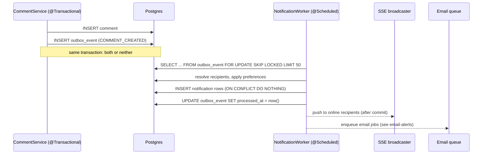

# Notifications (in-app queue)

A bell in the top bar with an inbox of things that need your attention, delivered live,
backed by a reliable queue so nothing is lost or sent twice.

> **Status:** proposed · **Depends on:** [collaborative-boards](../collaborative-boards/README.md) (recipients), [comments](../comments/README.md) and [mentions](../mentions/README.md) (most events) · **Unlocks:** [email-alerts](../email-alerts/README.md)

---

## 1. Goals and non-goals

**Goals (v1)**

- An **inbox** per person: unread count on a bell, a panel listing notifications, click to jump
  to the card, mark read / mark all read.
- **Live delivery** over the existing SSE connection.
- **Reliable:** a notification is created if and only if the thing that caused it was saved.
  No duplicates on retries.
- **Watching:** you get updates for cards you created, commented on, were mentioned on, or
  explicitly watch.
- **Preferences:** per notification type, choose in-app on/off and email off/instant/digest.
- **Grouping:** "3 new comments on CC-12" instead of three separate rows.

**Non-goals (v1)**

- Mobile push / browser push notifications (Web Push is a follow-up, §12).
- A message broker (Kafka, RabbitMQ). Postgres is enough for this scale; see §4.

## 2. What triggers a notification

| Type | Trigger | Recipients | Default |
|---|---|---|---|
| `MENTIONED` | Someone @mentions you | the mentioned person | in-app + email instant |
| `COMMENT_ON_WATCHED` | New comment on a card you watch | watchers except the author | in-app + email digest |
| `REPLY` | Reply to your comment | the parent comment's author | in-app + email instant |
| `STATUS_CHANGED` | A watched card changes lane | watchers except the mover | in-app |
| `DUE_SOON` | Due date is tomorrow | watchers | in-app + email digest |
| `OVERDUE` | Due date passed, not Completed | watchers | in-app + email digest |
| `PR_MERGED` | A linked PR merged ([PR linking](../github-pr-linking/README.md)) | watchers | in-app |
| `MEMBER_JOINED` | Someone accepted your invite | inviter | in-app |

Never notify people about their own actions.

## 3. Watching

```sql
CREATE TABLE content_watcher (
    content_id  INT    NOT NULL REFERENCES content(id) ON DELETE CASCADE,
    account_id  BIGINT NOT NULL REFERENCES account(id) ON DELETE CASCADE,
    reason      VARCHAR(12) NOT NULL CHECK (reason IN ('CREATOR','COMMENTER','MENTIONED','MANUAL')),
    muted       BOOLEAN NOT NULL DEFAULT false,     -- "Unwatch" sets muted instead of deleting,
    created_at  TIMESTAMPTZ NOT NULL DEFAULT now(), --  so commenting again doesn't re-subscribe you
    PRIMARY KEY (content_id, account_id)
);
```

Auto-watch on create, comment, and being mentioned (`INSERT ... ON CONFLICT DO NOTHING`).
Card detail shows a **Watch / Unwatch** toggle with the watcher count.

## 4. Architecture: transactional outbox → fan-out worker



**Why an outbox instead of sending right away?** If the API sent notifications directly and
then the transaction rolled back, people would be notified about a comment that doesn't exist.
Or the comment saves, the server crashes before notifying, and the notification is lost.
Writing the *intent* to a table in the same transaction makes both impossible.

**Why `FOR UPDATE SKIP LOCKED`?** Several workers (or several server instances) can poll the
same table; each row is claimed by exactly one of them, and nobody waits on anybody's locks.
This turns a plain table into a safe work queue.

### Tables

```sql
-- V{n}__notifications.sql
CREATE TABLE outbox_event (
    id            BIGSERIAL PRIMARY KEY,
    workspace_id  BIGINT      NOT NULL,
    type          VARCHAR(30) NOT NULL,
    payload       JSONB       NOT NULL,         -- ids only, e.g. {"commentId":481,"contentId":12,"actorId":3}
    created_at    TIMESTAMPTZ NOT NULL DEFAULT now(),
    available_at  TIMESTAMPTZ NOT NULL DEFAULT now(),  -- retry backoff
    attempts      INT         NOT NULL DEFAULT 0,
    last_error    TEXT,
    processed_at  TIMESTAMPTZ
);
CREATE INDEX outbox_pending ON outbox_event (available_at) WHERE processed_at IS NULL;

CREATE TABLE notification (
    id             BIGSERIAL PRIMARY KEY,
    recipient_id   BIGINT      NOT NULL REFERENCES account(id) ON DELETE CASCADE,
    workspace_id   BIGINT      NOT NULL REFERENCES workspace(id) ON DELETE CASCADE,
    type           VARCHAR(30) NOT NULL,
    content_id     INT         REFERENCES content(id) ON DELETE CASCADE,
    actor_id       BIGINT      REFERENCES account(id) ON DELETE SET NULL,
    event_id       BIGINT      NOT NULL,                -- outbox_event.id that produced it
    group_key      VARCHAR(80),                         -- e.g. 'COMMENT_ON_WATCHED:12'
    group_count    INT         NOT NULL DEFAULT 1,
    data           JSONB       NOT NULL DEFAULT '{}',   -- snapshot for display: card title, snippet
    created_at     TIMESTAMPTZ NOT NULL DEFAULT now(),
    updated_at     TIMESTAMPTZ NOT NULL DEFAULT now(),
    read_at        TIMESTAMPTZ,
    UNIQUE (event_id, recipient_id)                     -- idempotency: a retried event can't double-notify
);
CREATE INDEX inbox ON notification (recipient_id, updated_at DESC);
CREATE INDEX inbox_unread ON notification (recipient_id) WHERE read_at IS NULL;

CREATE TABLE notification_preference (
    account_id  BIGINT      NOT NULL REFERENCES account(id) ON DELETE CASCADE,
    type        VARCHAR(30) NOT NULL,
    in_app      BOOLEAN     NOT NULL DEFAULT true,
    email       VARCHAR(8)  NOT NULL DEFAULT 'DIGEST' CHECK (email IN ('OFF','INSTANT','DIGEST')),
    PRIMARY KEY (account_id, type)
);
```

Missing preference rows mean "use the default" from the table in §2. Only rows the user changed are stored.

### The worker

```java
@Component
class NotificationWorker {
    @Scheduled(fixedDelay = 2000)
    void drain() {
        List<OutboxEvent> batch = outbox.claimBatch(50);  // FOR UPDATE SKIP LOCKED, inside a transaction
        for (OutboxEvent e : batch) {
            try {
                fanOut(e);                                  // recipients → notification rows
                outbox.markProcessed(e);
            } catch (Exception ex) {
                outbox.scheduleRetry(e, ex);                // attempts++, available_at = now() + 2^attempts seconds
            }
        }
    }
}
```

- After 8 failed attempts, stop retrying and log loudly (a "dead letter" is just a row with
  `attempts >= 8 AND processed_at IS NULL`; build a tiny admin query for it).
- The 2-second poll means worst-case latency of about 2s. To make it instant, the API can also
  `NOTIFY outbox` after commit and the worker `LISTEN`s. Polling stays as the safety net.

### Grouping

When fanning out `COMMENT_ON_WATCHED` for card 12 to Priya, if Priya has an **unread** row
with `group_key = 'COMMENT_ON_WATCHED:12'` updated in the last 30 minutes, update it instead:
`group_count = group_count + 1, updated_at = now(), data = <latest snippet>`.
Mentions and replies are never grouped: they're personal and should stay visible.

### Due-date jobs

A separate `@Scheduled(cron = "0 0 * * * *")` job runs hourly and, for each account whose
**local** time is 08:00 (using `account.time_zone`), writes `DUE_SOON` / `OVERDUE` outbox events
for their watched cards. Idempotency key: `(content_id, type, date)` stored in the payload and
checked before inserting, so a restart at 08:05 doesn't send twice.

## 5. API

| Method & path | Purpose |
|---|---|
| `GET /api/notifications?cursor=&limit=30&filter=unread\|all` | Inbox, newest first, across all my workspaces. |
| `GET /api/notifications/unread-count` | `{ "count": 4 }` for the bell (also pushed over SSE). |
| `POST /api/notifications/read` `{ "ids": [..] }` | Mark some read. |
| `POST /api/notifications/read-all` | Mark all read. |
| `GET /api/me/notification-preferences` / `PUT` | Read and change preferences. |
| `PUT /api/workspaces/{ws}/content/{number}/watch` `{ "watching": true }` | Watch toggle. |

SSE: the per-workspace stream from collaborative-boards gains `notification.created`
(only sent to the recipient's connections) and `notification.count` events. Because
notifications span workspaces, also add a per-account stream `GET /api/me/events`, or have the
client keep one stream per open workspace plus poll `unread-count` every 60s as a fallback.

## 6. Frontend

**Top bar:** bell icon between Create and the avatar. Red count pill (max "9+").

**Panel** (Level 4 shadow, 380px wide, anchored under the bell):

```
Notifications                      Mark all read
[ Unread ] [ All ]
─────────────────────────────────────────────
● (P) Priya mentioned you on CC-12        2m
      "Can @harshal review before Friday?"
● (A) 3 new comments on CC-7              1h
  (H) CC-4 is overdue                      1d
─────────────────────────────────────────────
                     Notification settings →
```

- Unread rows have a 3px `--primary` left edge and a dot; clicking opens the card (and the
  specific comment, scrolled into view and briefly highlighted) and marks it read.
- Hover shows "Mark read" / "Mark unread".
- Empty state: "You're all caught up."
- New notifications arriving while the panel is closed bump the count, with no toast
  (toasts are for your own actions; this avoids noise).

**Settings page:** a table of the types from §2 with an in-app toggle and an email select
(Off / Instant / Daily digest).

**Card detail:** Watch toggle with an eye icon and "3 watching".

## 7. Security and privacy

- A notification is only visible to its recipient (`WHERE recipient_id = :me` on every query).
- The `data` snapshot must not include content from cards the recipient can no longer see.
  When a member is removed from a workspace, delete their notifications for it.
- If the card is deleted, notifications cascade away (`ON DELETE CASCADE`).
- Don't put full comment bodies in `data`; a 140-character snippet is enough and limits what
  sits in yet another table.

## 8. Retention and performance

- Delete read notifications older than 90 days and all older than 180 days (nightly job).
- Delete processed outbox rows older than 7 days.
- Inbox query uses `(recipient_id, updated_at DESC)`; unread count uses the partial index.
  Both stay fast into millions of rows.

## 9. Single-user version (before collaboration)

Only `DUE_SOON` and `OVERDUE` make sense with one person. They can ship on access-key boards
as a simple "Due soon" badge on the bell, computed on the fly from `due_date` without any of
the queue machinery. Keep that simple version until accounts exist.

## 10. Edge cases

- Recipient left the workspace between event and fan-out: skip them (check membership during fan-out).
- Same person is watcher *and* mentioned in one comment: send `MENTIONED` only (more specific
  type wins). The fan-out computes a per-recipient "best" type.
- Clock skew across instances: use database `now()` everywhere, never the JVM clock, for queue timing.
- Very active card (100 comments/hour): grouping keeps it to one row per 30 minutes per person.

## 11. Testing

- **Outbox atomicity:** make `CommentService` throw after inserting; assert neither the
  comment nor the outbox row exists.
- **Idempotency:** process the same outbox event twice; assert one notification per recipient.
- **Concurrency:** two workers draining the same table in parallel (two threads) never
  process one event twice.
- **Preferences:** type set to in-app off produces no row; email modes create the right email jobs.
- **Grouping:** 3 comments in 10 minutes → one row with `group_count = 3`.

## 12. Follow-ups

- **Web Push** (browser notifications even when the tab is closed): VAPID keys + service worker.
- **Snooze** a notification until tomorrow.
- **Slack/Discord webhook** per workspace as another delivery channel, reusing the same fan-out.
